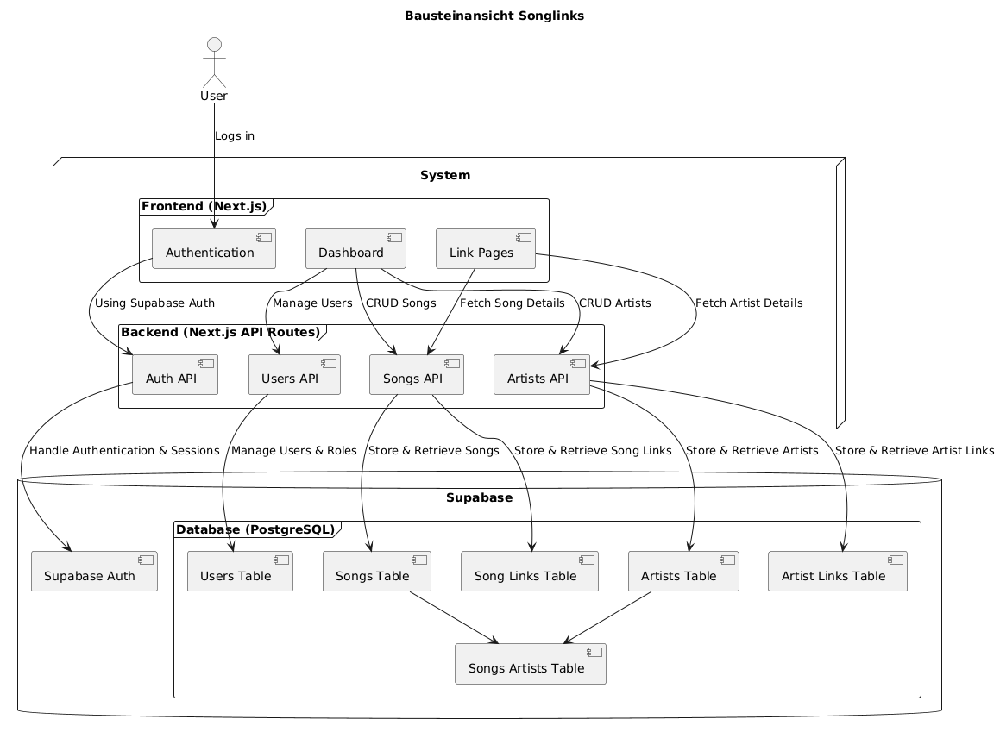
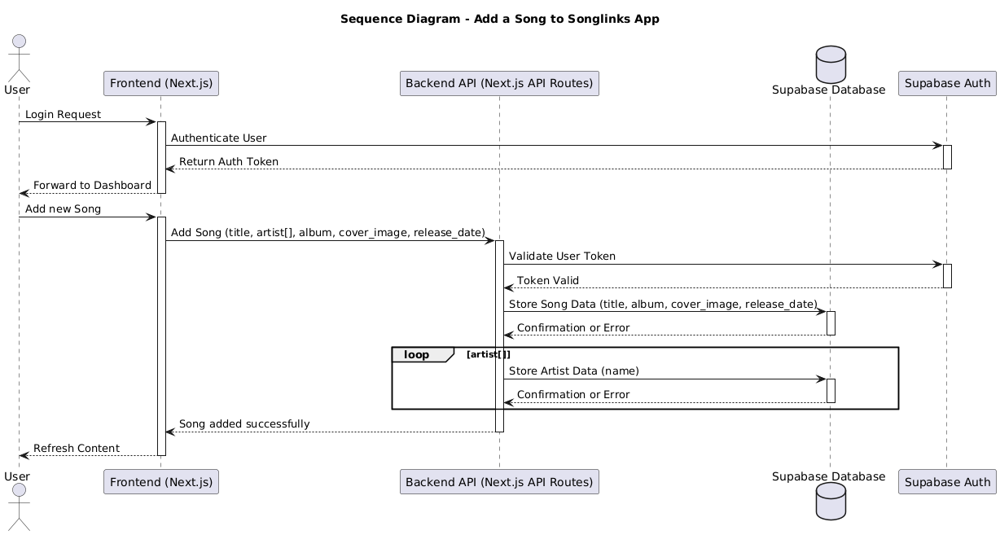
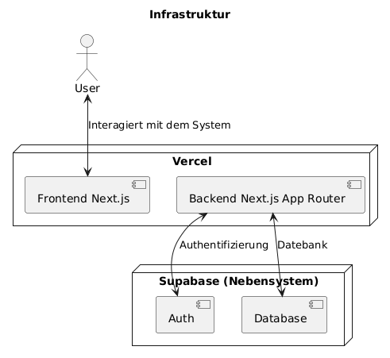

# Software Architektur


## Lösungsstrategie

siehe [Projektbeschrieb](../README.md)

## Bausteinsicht



### System

Das gesamthafte System basiert auf Next.js und Next.js App Router (Serverless) und wird auf Vercel gehostet.

### Frontend

Das Frotend ist in 3 "Kategorien" aufgeteilt:

- Authentication (und Landing Page): Zuständig für den initialen Eintritt
- Dashboard: Oberfläche für die Administrierung der Songs, Artists, etc.
- Link Pages: Die öffentlich zugänglichen Pages.

### Backend

Das Backend basiert auf Next.js App Router und funktioniert "serverless". Die APIs werden automatisch von Next.js/Vercel im Hintergrund erstellt. \

### Supabase Auth

Zuständig für die Authentifizierung und Sessions.

### Database

Zuständig für die Speicherung der Daten.

## Laufzeitsicht



Der Prozess zur Erstellung von Songs, Song Links, Artists und Artist Links sind alle ähnlich, weswegen nur 1 Diagramm erstellt wurde. \
Sie zeigt auf, wie ein solches Element erstellt wird und wie die Abfragen im Hintergrund ablaufen.


## Verteilungssicht



Sowohl Frontend als auch Backend wird auf Vercel gehostet. Dabei wird Next.js und Next.js App Router genutzt. \
Dies bietet ein gesamtheitliches und einfaches System, um die Webapplikation zu hosten.

Für eine saubere Authentifizierung wird Supabase Auth genutzt, welches sich sehr einfach mit Next.js integrieren lässt. \
Dasselbe gilt für den Storage, bei dem auf Supabase PostgreSQL Datenbanken zurückgegriffen wird.

## Querschnittliche Konzepte

### Security

Der Web-Applikation wird auf Vercel gehostet, welche via HTTPS abgesichert ist (Transportsicherheit).
Authentifizierung wird über Supabase Auth geregelt, welche eine korrekt Nutzung und Speicherung sicherstellt.

Ebenfalls ist die Datenbank via Row Level Security abgesichert, so dass folgende Policies eingehalten werden müssen:

```sql
-- Policies

-- artist_links
CREATE POLICY "Select for public"
ON artist_links
AS PERMISSIVE
FOR SELECT
TO public
USING (true);

CREATE POLICY "Insert for manager role"
ON artist_links
AS PERMISSIVE
FOR INSERT
TO authenticated
WITH CHECK ( 
  EXISTS (
    SELECT 1 
    FROM users 
    WHERE ((users.id = (select auth.uid() AS uid)) 
      AND (users.role = 'manager'::role_enum))
  )
);

CREATE POLICY "Update for manager role"
ON artist_links
AS PERMISSIVE
FOR UPDATE
TO authenticated
USING (
  EXISTS (
    SELECT 1 
    FROM users 
    WHERE (users.id = (select auth.uid()) 
      AND (users.role = 'manager'::role_enum))
  )
);

CREATE POLICY "Delete for manager role"
ON artist_links
AS PERMISSIVE
FOR DELETE
TO authenticated
USING (
  EXISTS (
    SELECT 1 
    FROM users 
    WHERE (users.id = (select auth.uid()) 
      AND (users.role = 'manager'::role_enum))
  )
);

CREATE POLICY "All for admin role" 
ON artist_links
AS PERMISSIVE
FOR ALL
TO authenticated 
USING (
  EXISTS (
    SELECT 1 
    FROM users 
    WHERE ((users.id = (select auth.uid() AS uid)) 
      AND (users.role = 'admin'::role_enum))
  )
);


-- artists
CREATE POLICY "Select for public"
ON artists
AS PERMISSIVE
FOR SELECT
TO public
USING (true);

CREATE POLICY "Insert for authenticated"
ON artists
AS PERMISSIVE
FOR INSERT
TO authenticated
WITH CHECK (true);

CREATE POLICY "Update based on created_by"
ON artists
AS PERMISSIVE
FOR UPDATE
TO authenticated
WITH CHECK (
  (select auth.uid()) = created_by
);

CREATE POLICY "Delete baesd on created_by"
ON artists
AS PERMISSIVE
FOR UPDATE
TO authenticated
WITH CHECK (
  (select auth.uid()) = created_by
);

CREATE POLICY "All for admin role" 
ON artists
FOR ALL
TO authenticated 
USING (
  EXISTS (
    SELECT 1 
    FROM users 
    WHERE ((users.id = (select auth.uid() AS uid)) 
      AND (users.role = 'admin'::role_enum))
  )
);

-- song_links
CREATE POLICY "Read for public"
ON song_links
AS PERMISSIVE
FOR SELECT
TO public
USING (true);

CREATE POLICY "Insert based on created_by"
ON song_links
AS PERMISSIVE
FOR INSERT
TO authenticated
WITH CHECK ((select auth.uid()) = (select created_by from songs where id = song_id));

CREATE POLICY "Update based on created_by"
ON song_links
AS PERMISSIVE
FOR UPDATE
TO authenticated
USING ((select auth.uid()) = (select created_by from songs where id = song_id));

CREATE POLICY "Update for manager role"
ON song_links
AS PERMISSIVE
FOR UPDATE
TO authenticated
USING (
  EXISTS (
    SELECT 1 
    FROM users 
    WHERE (users.id = (select auth.uid()) 
      AND (users.role = 'manager'::role_enum))
  )
);

CREATE POLICY "Insert for manager role"
ON song_links
AS PERMISSIVE
FOR INSERT
TO authenticated
WITH CHECK ( 
  EXISTS (
    SELECT 1 
    FROM users 
    WHERE (users.id = (select auth.uid()) 
      AND (users.role = 'manager'::role_enum))
  )
);

CREATE POLICY "All for admin role" 
ON song_links
FOR ALL
TO authenticated 
USING (
  EXISTS (
    SELECT 1 
    FROM users 
    WHERE ((users.id = (select auth.uid() AS uid)) 
      AND (users.role = 'admin'::role_enum))
  )
);

-- songs
CREATE POLICY "Read for public"
ON songs
AS PERMISSIVE
FOR SELECT
TO public
USING (true);

CREATE POLICY "Insert for authenticated"
ON songs
AS PERMISSIVE
FOR INSERT
TO authenticated
WITH CHECK (true);

CREATE POLICY "Update based on created_by"
ON songs
AS PERMISSIVE
FOR UPDATE
TO authenticated
USING ((select auth.uid()) = created_by);

CREATE POLICY "Update for manager role"
ON songs
AS PERMISSIVE
FOR UPDATE
TO authenticated
USING (
  EXISTS (
    SELECT 1 
    FROM users 
    WHERE (users.id = (select auth.uid()) 
      AND (users.role = 'manager'::role_enum))
  )
);

CREATE POLICY "Allow all for admin role" 
ON songs
FOR ALL
TO authenticated 
USING (
  EXISTS (
    SELECT 1 
    FROM users 
    WHERE ((users.id = (select auth.uid() AS uid)) 
      AND (users.role = 'admin'::role_enum))
  )
);


-- songs_artists
CREATE POLICY "Read for public"
ON songs_artists
AS PERMISSIVE
FOR SELECT
TO public
USING (true);

CREATE POLICY "Insert for authenticated"
ON songs_artists
AS PERMISSIVE
FOR INSERT
TO authenticated
WITH CHECK (true);

CREATE POLICY "Update based on created_by"
ON songs_artists
AS PERMISSIVE
FOR UPDATE
TO authenticated
USING ((select created_by from songs where id = song_id) = (select auth.uid()));

CREATE POLICY "Update for manager role"
ON songs_artists
AS PERMISSIVE
FOR UPDATE
TO authenticated
USING (
  EXISTS (
    SELECT 1 
    FROM users 
    WHERE (users.id = (select auth.uid()) 
      AND (users.role = 'manager'::role_enum))
  )
);

CREATE POLICY "Allow all for admin role" 
ON songs_artists
FOR ALL
TO authenticated 
USING (
  EXISTS (
    SELECT 1 
    FROM users 
    WHERE ((users.id = (select auth.uid() AS uid)) 
      AND (users.role = 'admin'::role_enum))
  )
);

-- users
CREATE POLICY "Allow all for admin role" 
ON users
FOR ALL
TO authenticated 
USING (
  EXISTS (
    SELECT 1 
    FROM users 
    WHERE ((users.id = (select auth.uid() AS uid)) 
    AND (users.role = 'admin'::role_enum))
  )
);
```

## Architekturentscheidungen

* Hosting via Vercel (Next.js + Next.js App Router)
* Authentifizierung via Supabase Auth
* Storage via Supabase Storage

## Qualitätsanforderungen

siehe [Projektbeschrieb](../README.md#qualitätsanforderungen)
